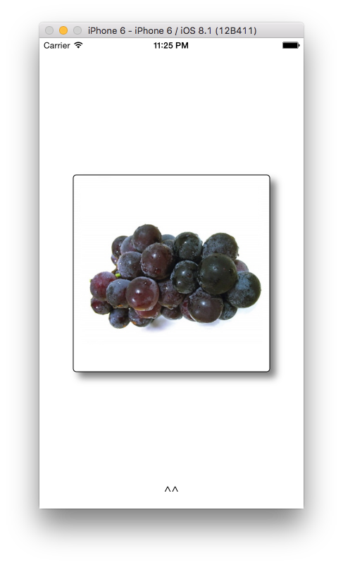
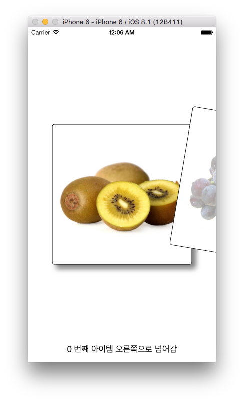

# HSSwipeableView
파일럿 프로젝트  세번째 과제입니다.<br>

Tinder 스타일의 뷰입니다.
좌우로 스와이프 해서 넘길 수 있습니다.

* `HSSwipeableView` 폴더 통째로 가져가서 쓰시면 됩니다.
* `HSSwipeableViewExample` 폴더는 HSSwipeableView 적용한 예제 프로젝트입니다. (이미지포함)

## 사용법
`HSSwipeableView.h` 헤더파일 Import `HSSwipeableView` 뷰를 생성해서 add합니다.
```Objective-C
#import "HSSwipeableView.h" 

HSSwipeableView *swipeView = [[HSSwipeableView alloc] initWithFrame:CGRectMake(0, 0, 280, 280)];

[self.view addSubview:swipeView];
```

`HSSwipeableView`에 내용(뷰)을 넣으려면 `contentView` 프로퍼티에 설정하면 됩니다.
```Objective-C
swipeView.contentView = 내용뷰;
```

Swipe해서 뷰를 넘기고 나서 처리할 Block 설정은 `setBlock` 메서드
```Objective-C
[swipeView setSwipedBlock:^(HSSwipeableViewSwiped direction) {

    switch (direction) {
        case HSSwipeableViewSwipedLeft: {
            // 왼쪽으로 스와이프해서 넘겼을때
            break;
        }
        case HSSwipeableViewSwipedRight: {
            // 오른쪽으로 스와이프해서 넘겼을때
            break;
        }
	}
}];
```

## 스크린샷

